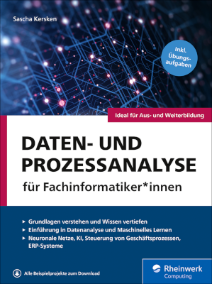

# Daten- und Prozessanalyse für Fachinformatiker*innen
Hier finden Sie die Listings und Lösungen aus meinem Buch »Daten- und Prozessanalyse für Fachinformatiker*innen«.

[Mehr Infos und Bestellung beim Rheinwerk Verlag](https://www.rheinwerk-verlag.de/daten-und-prozessanalyse-fuer-fachinformatiker/)

Informationen und Materialien (Listing, Lösungen) finden Sie auch [hier](https://www.rheinwerk-verlag.de/daten-und-prozessanalyse-fuer-fachinformatiker/). Klicken Sie dort auf den Reiter "Materialien", um die Materialien herunterzuladen.

Fragen, Anmerkungen oder Errata zum Buch bitte per E-Mail an [it-handbuch@sascha-kersken.de](mailto:it-handbuch@sascha-kersken.de). 
Und/oder folgen Sie [@fidp_buch](https://twitter.com/fidp_buch) auf Twitter.
